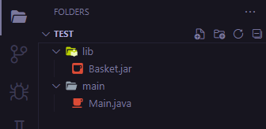
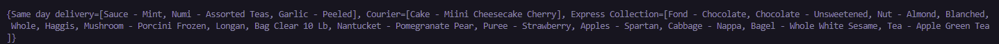

# Basket Splitter

Jest to biblioteka stworzona za pomocą języka programowania Java, która udostępnia dwie klasy: **Basket** oraz **BasketSplitter**.

### Interface klasy **Basket**
```java
Basket {
    public Basket(String absolutePathToBasketFile);
    public String toString();
    public List<String> getItems();
}
```
 - `Basket(String absolutePathToBasketFile)` - konstruktor klasy, który jako argument przyjmuje ścieżkę absulutną do pliku typu json, w którym znajduje się lista przedmiotów
 - `public List<String> getItem()` - metoda zwracająca listę przedmiotów w koszyku
 - `public String toString()` - metoda, która w czytelny sposób wyświetla zawartość koszyka

### Interface klasy **BasketSplitter**
```java
BasketSplitter {
    public BasketSplitter(String absolutePathToConfigFile);
    public Map<String, List<String>> split(List<String> items);
    public String toString();
    public Map<String, List<String>> getProductsAndDeliveryTypes();
}
```
 - `BasketSplitter(String absolutePathToConfigFile)` - konstruktor klasy, który jako argument przyjmuje ścieżkę absolutną do pliku typu json, w którym znajduje się konfiguracja sklepu, tzn. możliwe sposoby dostawy produktów
 - `public Map<String, List<String>> split(List<String> items)` - główna metoda klasy, która, wykorzystując wczytaną wcześniej konfigurację sklepu, rozdziela przedmioty z listy pomiędzy sposoby dostaw w optymalny sposób - na najmniejszą liczbę grup dostaw, każda z grup ma maksymalną liczbę przedmiotów
  - `public String toString()` - metoda, która w czytelny sposób wyświetla konfigurację sklepu
  - `public Map<String, List<String>> getProductsAndDeliveryTypes()` - metoda zwaracjąca konfigurację sklepu jako mapę przedmiotów oraz sposobu ich dostaw

## Algorytm dzielenia koszyka

Po wstępniej walidacji argumentu funkcji algorytm działa iteracyjnie. W każdej iteracji występuje kilka kroków: 
 1. Jeśli w koszyku (na liście przedmiotów) znajduje się tylko jeden przedmiot, wtedy znajdowany jest pierwszy sposób dostawy skojarzony z tym produktem, a następnie dodawany jest on do mapy zwracanej jako wynik działania metody (wraz z listą, która zawiera tylko ten przedmiot) oraz wykonanie algorytmu jest przerywane, a wynik zwracany.
 2. Na podstawie listy przedmitów (z wykorzystaniem konfiguracji sklepu) tworzona jest mapa o strukturze: `sposób dostawy - lista przedmiotów`. Następnie, dla każdego sposobu dostawy znajdującego się w mapie sprawdzana jest ilość przedmiotów, które tą metodą mogą zostać dostarczone.
    - Jeśli taka sama ilość przedmiotów może być dostarczona na więcej niż jeden sposób uruchamiana jest rekurencyjnie metoda `split()` na listach przedmiotów pomniejszonych o przedmioty, które mogą być dostarczone daną metodą. Po uzyskaniu wszystkich możliwych kombinacji wybierana jest ta, która zawiera najmniej grup dostaw. Do tego wyniku (mapy) dodawany jest rekord określający najliczniejszą grupę przedmiotów, a następnie mapa jest zwracana.
 3. Jeśli jest tylko jedna najliczniejsza grupa przedmiotów skojarzona z jednym sposobem dostawy, jest ona zapisywana do struktury wynikowej.
 4. Z koszyka (listy przedmiotów) usuwane są przedmioty już dopasowane do sposobu dostawy.
 5. Następuje powót do kroku **1**, jeśli w koszyku znajdują się jeszcze przedmioty.

## Przykładowe wykorzystanie biblioteki

W repozytorium znajduje się plik `Basket.jar`. Załączając go do swojego projektu możliwe jest wykorzystanie klas `Basket` oraz `BasketSplitter`.



*Przykładowa struktura projektu*

Następnie w klasie `Main` wystarczy zaimportować odpowiednie klasy:
```java
package main;

import com.ocado.basket.Basket;
import com.ocado.basket.BasketSplitter;

public class Main {
    public static void main(String[] args) {
        Basket basket = new Basket(
                "C:\\Users\\konra\\Desktop\\Basket-Split\\src\\test\\java\\com\\ocado\\basket\\resources\\basket-2.json");

        BasketSplitter basketSplitter = new BasketSplitter(
                "C:\\Users\\konra\\Desktop\\Basket-Split\\src\\test\\java\\com\\ocado\\basket\\resources\\config.json");

        System.out.println(basketSplitter.split(basket.getItems()));
    }
}
```

Po uruchomieniu programu w taki sposób wynik zostanie wypisany na ekran:

